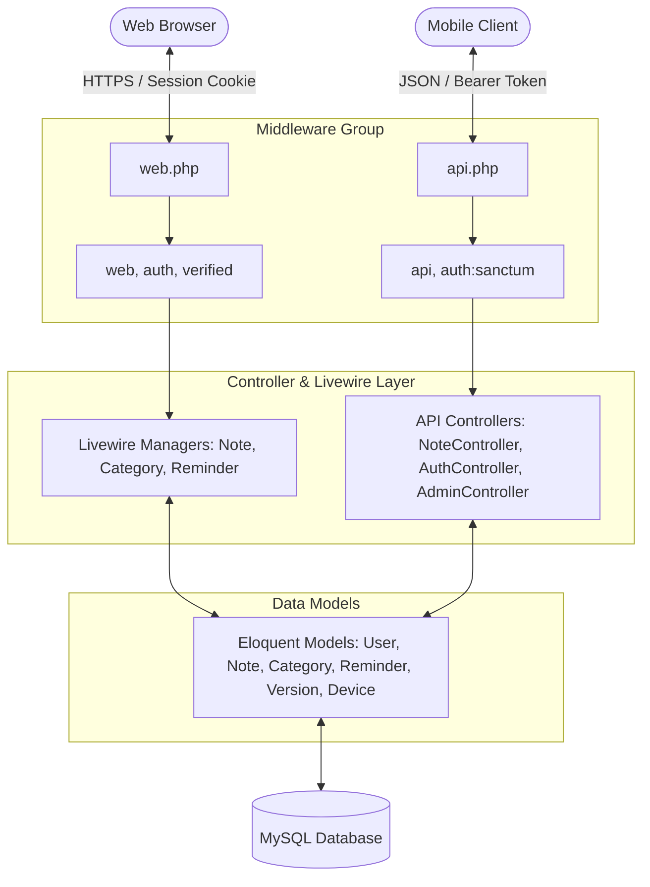
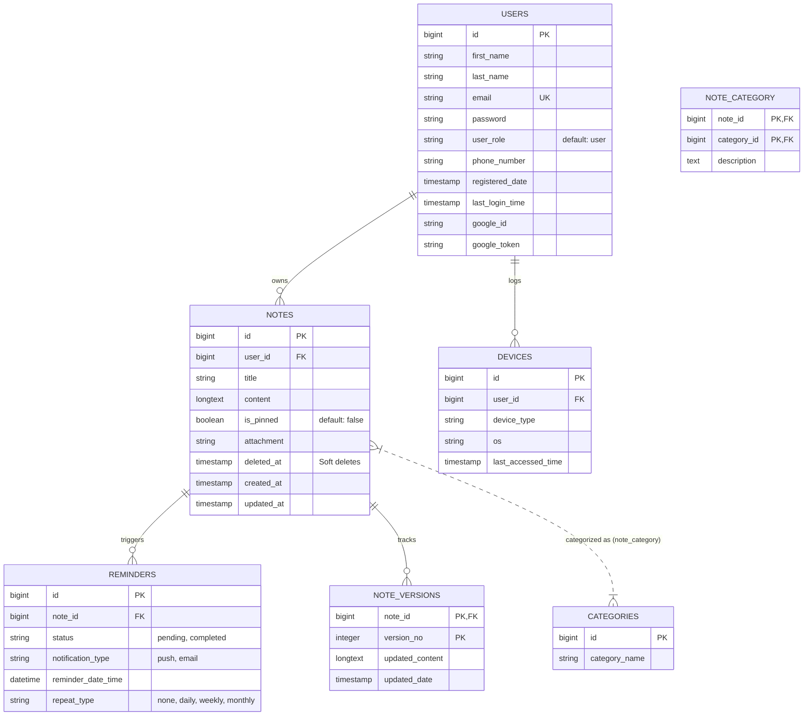

# NoteHub - Full Project Documentation

This documentation provides an exhaustive overview of the **NoteHub** application, describing its requirements, architecture, database schemas, security mechanics, API integration, deployment details, and testing protocols.

---

## Table of Contents
1. [Introduction](#1-introduction)
2. [Project Objectives](#2-project-objectives)
3. [Technologies Used](#3-technologies-used)
4. [System Architecture](#4-system-architecture)
5. [Database Design](#5-database-design)
6. [Laravel 12 Implementation](#6-laravel-12-implementation)
7. [Authentication System](#7-authentication-system)
8. [Laravel Sanctum API Authentication](#8-laravel-sanctum-api-authentication)
9. [Security Implementation](#9-security-implementation)
10. [CRUD Functionalities](#10-crud-functionalities)
11. [API Development](#11-api-development)
12. [AWS Deployment](#12-aws-deployment)
13. [GitHub Integration](#13-github-integration)
14. [Testing](#14-testing)
15. [Challenges and Solutions](#15-challenges-and-solutions)
16. [Conclusion](#16-conclusion)
17. [References](#17-references)
18. [Appendices](#18-appendices)

---

## 1. Introduction
**NoteHub** is a state-of-the-art "Second Brain" note-taking application designed for modern professionals, researchers, and students. By combining note compilation, color-coded categorization, chronological reminders, version tracking, and a secure multi-device environment, NoteHub enables users to organize their intellectual assets seamlessly. 

The application is built on the robust, secure Laravel framework, providing two primary interfaces:
*   **Web Portal:** A beautiful, responsive Blade & Livewire web application optimized for web browsers.
*   **REST API:** A secure, token-protected JSON API designed to support mobile clients, desktop applications, or third-party integrations.

---

## 2. Project Objectives
*   **Secure Data Isolation:** Guarantee that users can only view, edit, or delete their own notes, categories, and reminders.
*   **Dual Authentication Pipeline:** Implement session-based authentication for web users and token-based stateful/stateless authentication for API consumers.
*   **Automated Audit Trails:** Maintain a history of changes to notes via automated versioning.
*   **Administrative Supervision:** Build an administrative dashboard for monitoring database metrics, user profiles, and note moderation.
*   **Cloud Deployment:** Deliver a production-ready application deployed on secure, scalable cloud infrastructure.

---

## 3. Technologies Used

| Layer | Technology | Version / Details |
| :--- | :--- | :--- |
| **Core Framework** | Laravel | 12.0 (PHP 8.2+) |
| **Database** | MySQL | 8.0+ (Production on AWS RDS/EC2) |
| **Reactivity** | Laravel Livewire | 3.x (Component-based reactive views) |
| **Styling** | Tailwind CSS | 3.x / 4.x (Vite build) |
| **Authentication** | Jetstream & Fortify | Standard session authentication, Profile Management, 2FA |
| **OAuth Broker** | Laravel Socialite | Google OAuth 2.0 |
| **API Auth Guard** | Laravel Sanctum | Token-based Bearer authentication |
| **Document Export** | Barryvdh DomPDF | Dynamic PDF generation from HTML views |
| **Hosting Server** | AWS EC2 | Ubuntu 22.04 LTS, Apache2 Web Server |

---

## 4. System Architecture

NoteHub implements a modern Model-View-Controller (MVC) architecture enhanced with **Laravel Livewire** for full-stack reactivity without requiring complex client-side JavaScript frameworks.

### 4.1 Architecture Diagram


### 4.2 Role-Based Privilege Hierarchy
The system supports two user roles:
1.  **Standard User (`user`):** Can manage their own notes, categories, and reminders. Cannot access administrative endpoints or view other users' data.
2.  **Administrator (`admin`):** Can access the admin dashboard, inspect application-wide statistics, promote/demote users, and permanently delete flagged notes or inappropriate user accounts.

---

## 5. Database Design

The database schema is highly normalized to third normal form (3NF) to prevent redundancy and protect data integrity.

### 5.1 Entity Relationship Diagram (ERD)


---

## 6. Laravel 12 Implementation

The routes and middleware structures in Laravel 12 are fully isolated to ensure appropriate session and API lifecycle processing.

### 6.1 Routing Architecture (`bootstrap/app.php`)
The routing layer separates web request pipelines from API endpoints.
*Location:* [bootstrap/app.php](file:///c:/xampp/htdocs/testnote-2-server-side-sem-2-laravel/bootstrap/app.php)
```php
return Application::configure(basePath: dirname(__DIR__))
    ->withRouting(
        commands: __DIR__.'/../routes/console.php',
        health: '/up',
        using: function () {
            Route::middleware('web')
                ->group(base_path('routes/web.php'));

            Route::group([], base_path('routes/api.php'));
        },
    )
    ->withMiddleware(function (Middleware $middleware): void {
        $middleware->alias([
            'admin' => \App\Http\Middleware\AdminMiddleware::class,
        ]);
    });
```

---

## 7. Authentication System

NoteHub implements two main user authentication methods for web portal access:

### 7.1 Laravel Jetstream & Fortify Session-Based Login
For standard web users, Laravel Jetstream manages registration, password verification, active sessions, and Two-Factor Authentication (2FA).
*   **Two-Factor Authentication:** Uses Time-Based One-Time Passwords (TOTP) compatible with Google Authenticator. Users are provided emergency recovery codes if they lose access to their authenticator device.
*   **Active Session Control:** Allows users to view all devices currently holding a valid session cookie and logout other devices remotely.

### 7.2 Google OAuth 2.0 (Socialite) Integration
Allows frictionless registration and login using verified Google profiles.
*Location:* [app/Http/Controllers/Auth/GoogleController.php](file:///c:/xampp/htdocs/testnote-2-server-side-sem-2-laravel/app/Http/Controllers/Auth/GoogleController.php)
```php
public function handleGoogleCallback(): RedirectResponse
{
    $googleUser = Socialite::driver('google')->user();
    
    $user = User::where('google_id', $googleUser->getId())->first();

    if (!$user) {
        $user = User::where('email', $googleUser->getEmail())->first();

        if ($user) {
            $user->update([
                'google_id' => $googleUser->getId(),
                'google_token' => $googleUser->token,
            ]);
        } else {
            $nameParts = User::parseFullName($googleUser->getName());
            $user = User::create([
                'first_name' => $nameParts['first_name'] ?: 'Google',
                'last_name' => $nameParts['last_name'] ?: 'User',
                'email' => $googleUser->getEmail(),
                'google_id' => $googleUser->getId(),
                'google_token' => $googleUser->token,
                'password' => Hash::make(Str::random(24)),
                'registered_date' => now(),
                'email_verified_at' => now(),
            ]);
        }
    }
    Auth::login($user, true);
    return redirect()->intended('/dashboard');
}
```

---

## 8. Laravel Sanctum API Authentication

For third-party clients and mobile applications, stateful session cookie authentication is replaced by cryptographically unique tokens issued via **Laravel Sanctum**.

### 8.1 API Credentials Check & Token Generation
Upon posting valid credentials, the system records the client device configuration and issues a plain-text Sanctum token (which must be sent in the `Authorization: Bearer <token>` header of subsequent requests).
*Location:* [app/Http/Controllers/Api/AuthController.php](file:///c:/xampp/htdocs/testnote-2-server-side-sem-2-laravel/app/Http/Controllers/Api/AuthController.php)
```php
public function login(Request $request)
{
    $request->validate([
        'email' => 'required|string|email',
        'password' => 'required|string',
        'device_name' => 'nullable|string'
    ]);

    $user = User::where('email', $request->email)->first();

    if (! $user || ! Hash::check($request->password, $user->password)) {
        throw ValidationException::withMessages([
            'email' => ['The provided credentials are incorrect.'],
        ]);
    }

    if ($request->device_name) {
        $user->devices()->create([
            'device_type' => $request->device_name,
            'os' => $request->header('User-Agent', 'unknown'),
            'last_accessed_time' => now(),
        ]);
    }

    $token = $user->createToken($request->device_name ?? 'auth_token')->plainTextToken;

    return response()->json([
        'access_token' => $token,
        'token_type' => 'Bearer',
        'user' => $user
    ]);
}
```

---

## 9. Security Implementation

NoteHub deploys multiple defensive security mechanisms to meet industry-standard security guidelines:

### 9.1 Prevention of Insecure Direct Object Reference (IDOR)
To guarantee data privacy, resources are always accessed through relationship scopes tied to the authenticated user.
*   **Secure Scope Example:**
    `$request->user()->notes()->findOrFail($note_id);`
    If a user attempts to modify a note owned by another user, the query throws an Eloquent `ModelNotFoundException`, returning a clean `404 Not Found` response instead of exposing the resource's existence.

### 9.2 Prevention of SQL Injection (SQLi)
*   All queries are written using Laravel's **Eloquent ORM** or the query builder, which automatically leverages PDO parameter binding. This strictly separates SQL instructions from user inputs, rendering SQL injection impossible.

### 9.3 Role-Based Access Control (RBAC)
Custom middleware intercepts restricted actions to verify user permissions.
*Location:* [app/Http/Middleware/AdminMiddleware.php](file:///c:/xampp/htdocs/testnote-2-server-side-sem-2-laravel/app/Http/Middleware/AdminMiddleware.php)
```php
public function handle(Request $request, Closure $next): Response
{
    if (auth()->check() && auth()->user()->role === 'admin') {
        return $next($request);
    }
    abort(403, 'Unauthorized. Admin access required.');
}
```

---

## 10. CRUD Functionalities

NoteHub provides robust Create, Read, Update, and Delete operations for notes, categories, and reminders, utilizing database-level transaction integrity and versioning control.

### 10.1 Automated Version Audits
Whenever a note's title or content changes, the application logs the edit in the `note_versions` table, archiving the previous version.
```php
if ($note->wasChanged(['title', 'content'])) {
    $nextVersion = (int) $note->versions()->max('version_no') + 1;
    $note->versions()->create([
        'version_no' => $nextVersion,
        'updated_content' => $note->content,
        'updated_date' => now(),
    ]);
}
```

### 10.2 Soft Deleting & Recycle Bin Recovery
*   **Deletion:** Deleting a note moves it to the Recycle Bin (`deleted_at` timestamp is written).
*   **Restoration:** Standard users can restore the note, clearing the `deleted_at` state.
*   **Permanent Purging:** Users can empty their trash, removing the database entries and their attached files permanently.

---

## 11. API Development

All endpoints return uniform, structured JSON payloads with standard HTTP response codes:
*   `200 OK` — Success.
*   `201 Created` — Resource created successfully.
*   `204 No Content` — Successful deletion.
*   `401 Unauthorized` — Invalid or missing API token.
*   `403 Forbidden` — Accessing resources owned by other users or accessing admin routes without privileges.
*   `422 Unprocessable Entity` — Request failed validation constraints.

---

## 12. AWS Deployment

NoteHub was deployed on AWS EC2 to guarantee high availability and stability.

### 12.1 Environment Set Up
1.  **Virtual Server:** Provisioned an AWS EC2 instance running Ubuntu 22.04 LTS.
2.  **Web Server:** Configured Apache2 with `mod_rewrite` enabled to handle Laravel's routing pipeline.
3.  **Domain Mapping:** Configured a dynamic wildcard domain mapping via `nip.io` pointing to the public IP of the EC2 instance. This was required because Google OAuth prevents callbacks to raw IP addresses.
4.  **Production Optimizations:** Ran configuration and route compilation commands:
    ```bash
    php artisan config:cache
    php artisan route:cache
    php artisan view:cache
    npm run build
    ```

---

## 13. GitHub Integration

Version control and collaboration were managed using a clean workflow on GitHub:
*   **Repository Structure:** Hosted on GitHub with separate development and main deployment branches.
*   **Ignore Patterns:** `.gitignore` excludes vendor directories, node_modules, compiled public assets, database files (sqlite), and local configuration files (`.env`).

---

## 14. Testing

A complete automated testing suite was implemented to verify user authentication pipelines and business logic security.

### 14.1 Executing Tests
To verify all features, run:
```bash
php artisan test
```
The test suite covers:
*   **Authentication Tests:** Verifying registration, login validation, and failed authentication limits.
*   **Profile Tests:** Confirming user profile changes and password updates.
*   **Soft Deletes Test:** Asserting that notes are correctly soft-deleted and displayed in the Recycle Bin before restoration.
*   **2FA Verification:** Confirming 2FA activation, recovery code generation, and deactivation.

---

## 15. Challenges and Solutions

### 15.1 Google OAuth IP Restrictions
*   *Challenge:* Google OAuth 2.0 console prohibits registering callback URIs that use raw IP addresses (e.g. `http://44.197.113.192/auth/google/callback`).
*   *Solution:* Integrated dynamic IP mapping using a `nip.io` domain (e.g., `http://44-197-113-192.nip.io/auth/google/callback`), fulfilling Google's strict domain standards.

### 15.2 Hybrid Session / API Routing Conflict
*   *Challenge:* Standard API routing under Laravel applies the stateless `api` middleware, which strips session cookies. This made it difficult for Livewire components inside web views to authenticate if they were mixed with REST routes.
*   *Solution:* Clearly separated routing layers. Web views and Livewire components are authenticated via session-based `'auth'` in `routes/web.php`. The stateless REST API resources use `'auth:sanctum'` inside `routes/api.php` under the `/api` prefix.

---

## 16. Conclusion
The **NoteHub** application is a secure, reactive, and reliable note-taking system. Built on Laravel 12 and MySQL, it leverages standard frameworks like Jetstream, Sanctum, and Socialite to provide secure authentication, data privacy, and administration tools. It is ready for production use and deployed on scalable AWS infrastructure.

---

## 17. References
*   [Laravel 12 Framework Documentation](https://laravel.com/docs/12.x)
*   [Laravel Jetstream Documentation](https://jetstream.laravel.com/)
*   [Laravel Sanctum Reference Guide](https://laravel.com/docs/12.x/sanctum)
*   [Laravel Socialite OAuth Integration](https://laravel.com/docs/12.x/socialite)

---

## 18. Appendices

### 18.1 Key Artisan Commands Reference
*   **Reset database state & run seeders:**
    `php artisan migrate:fresh --seed`
*   **List all active routing endpoints:**
    `php artisan route:list`
*   **Clear config cache during updates:**
    `php artisan config:clear`
*   **Execute unit and feature tests:**
    `php artisan test`
