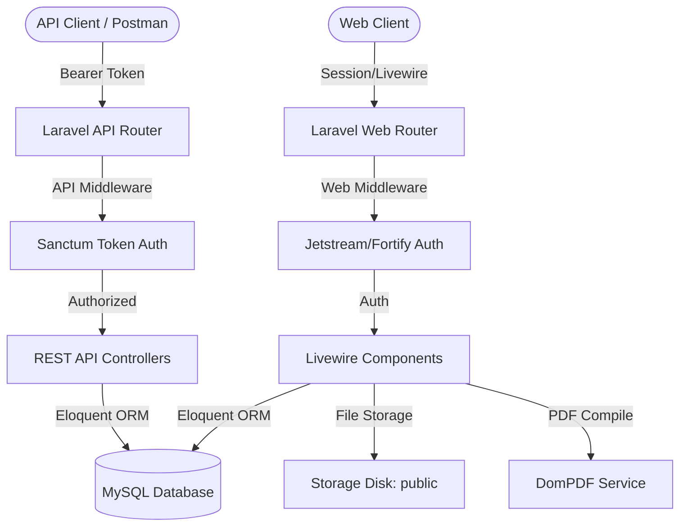

# SSP2 Viva Preparation Guide

This guide is designed to prepare you for the Server-Side Web Programming 2 (SSP2) viva examination for your Laravel 12 note management system, **NoteHub**. It is written from the perspectives of a University Lecturer, Assignment Examiner, and Laravel Technical Interviewer.

---

## Project Overview

### Project Purpose
**NoteHub** is a highly secure, responsive, multi-device personal note-taking and management web application. It provides users with a central platform to compose, organize, track, and protect their thoughts. Key features include markdown/text notes, category tagging, pinning crucial notes, soft-deletion (Recycle Bin recovery), note version history (audit logs), PDF export, and reminder scheduling.

### Business Problem Solved
Traditional note-taking applications often suffer from issues such as:
1. **Lack of Organization**: Users struggle to categorize and search through high volumes of text.
2. **Accidental Deletions**: Deleting a note is typically permanent and leads to immediate data loss.
3. **No Auditing or Version Control**: Overwriting a note destroys previous iterations, leaving no rollback capability.
4. **Platform Lock-in & Poor Integration**: No RESTful API access for third-party systems or mobile devices.
5. **Security Risks**: Confidential notes stored in plain text without secure authentication, role-based authorization, or multi-device activity logs.

NoteHub solves these issues by combining a reactive, real-time Livewire web interface with a secure, standard-compliant REST API. It uses automated versioning, soft-deletes with restore capability, role-based access control, Google OAuth login, and secure multi-device session tracking.

### Technologies Used
* **Backend Framework**: Laravel 12.x (PHP 8.2+)
* **Frontend Reactive Engine**: Livewire v3 (Real-time reactivity without writing heavy JavaScript SPAs)
* **CSS Framework**: Tailwind CSS (via Laravel Jetstream/Volt styling ecosystem)
* **Authentication Suites**: 
  * Laravel Jetstream & Laravel Fortify (Session auth, Profile management, and Two-Factor Authentication)
  * Laravel Sanctum (Stateful API token-based authentication)
  * Laravel Socialite (Third-party Google OAuth integration)
* **Database**: MySQL 8.0+ (Relational SQL Database)
* **PDF Utility**: `barryvdh/laravel-dompdf` (Server-side PDF generation)

### System Architecture
NoteHub follows a modern hybrid architecture:


---

# SECTION 1: Laravel 12

## What I Implemented
* A robust routing system separating standard Web views, Google Socialite authentication, and REST API endpoints.
* Custom middleware to enforce role-based access control (`AdminMiddleware`) checking for `role === 'admin'`.
* Standardized Service Providers for boot-level configurations.
* Database migrations modeling 7 custom tables, utilizing foreign key constraints and index optimizations.
* Form requests, validation rule blocks, and structured Controllers separating business logic from raw requests.

## Why I Used Laravel 12
Laravel 12 is the latest enterprise-grade PHP framework. It brings key advantages:
1. **PHP 8.2+ Native Features**: Strong type safety, readonly properties, and constructor promotion.
2. **Vite Integration**: Out-of-the-box asset compiling with hot-module reloading.
3. **Advanced Security**: Native protection against SQL injection, CSRF, and XSS.
4. **Eloquent ORM**: Highly intuitive ActiveRecord implementation for complex database queries.
5. **Modern Middleware & Route Isolation**: Clean declaration of route groups separating stateful web requests and stateless APIs.

## Viva Questions & Model Answers

### Q1: Why did you choose Laravel over raw PHP or other frameworks?
**Model Answer:**  
"Laravel provides an enterprise-ready architecture that eliminates boilerplate code. Writing raw PHP requires manually building database connection pools, security sanitizers, router parsers, and authentication flows, which is error-prone. Compared to other frameworks (e.g., CodeIgniter or Symfony), Laravel offers a cohesive ecosystem—such as Jetstream for authentication, Sanctum for APIs, and Livewire for frontend reactivity—speeding up development while enforcing strict security standards like CSRF protection, SQL injection prevention, and secure password hashing by default."

### Q2: Can you explain the Model-View-Controller (MVC) pattern in Laravel?
**Model Answer:**  
"MVC is a software design pattern that separates application logic into three interconnected components:
1. **Model**: Represents the data structures, database rules, and relationships (e.g., `Note.php`, `User.php`). It queries and persists data.
2. **View**: The user interface layer (Blade templates and Livewire components) displaying data to the user.
3. **Controller**: The brain that intercepts incoming HTTP requests, queries the model for data, processes business logic, and returns the appropriate view or JSON response (e.g., `NoteController.php`)."

### Q3: What is the Laravel Request Lifecycle? Explain what happens from the moment a request hits your site.
**Model Answer:**  
"The lifecycle flows as follows:
1. The web server (Apache/Nginx) directs the request to `public/index.php`.
2. Composer loads the autoloader, and the application instance is retrieved from `bootstrap/app.php`.
3. The request is sent to either the **HTTP Kernel** or the **Console Kernel**.
4. The HTTP Kernel bootstrapping process loads configurations, handles error detection, and registers **Service Providers** (running their `register` and then `boot` methods).
5. The request passes through the **Global Middleware** stack (e.g., CheckForMaintenanceMode, ValidatePostSize).
6. The router matches the URL to a defined route, applying **Route Middleware** (e.g., `auth`, `csrf`).
7. The request enters the Controller, which interacts with Models, performs business logic, and returns a Response.
8. The response flows back through the middleware stack and is delivered to the user's browser."

---

## Common Follow-Up Questions

### Q1: What is a Service Provider and when would you create one?
**Answer:** Service Providers are the central place to bootstrap Laravel applications. They bind classes into the service container or register event listeners, gates, and custom validation rules. You create one if you need to register a custom service class, set up a third-party SDK client, or establish global view-share variables.

### Q2: What is Middleware and how does it secure your application?
**Answer:** Middleware acts as an HTTP request filter. When a request comes in, middleware inspects it before it reaches the controller (e.g., `Auth` middleware checks if a user is logged in). If unauthorized, it redirects them or returns a 403 error, protecting backend logic from unauthenticated execution.

---
## Technical Deep Dive
```
[HTTP Request] ➔ [public/index.php] ➔ [HTTP Kernel] ➔ [Service Providers] ➔ [Middleware Group] ➔ [Router] ➔ [Controller] ➔ [Response]
```

* **Routing**: Defined in `routes/web.php` and `routes/api.php`. Routes define entry points. Laravel matches URI patterns to closures or controller actions.
* **Migrations**: Version control for database tables. They allow developers to define, modify, and rollback schema layouts programmatically (e.g., `Schema::create('notes', ...)`).
* **Event Listeners**: Decouple application components. For example, when a `UserRegistered` event fires, a listener catches it and sends a welcome email without slowing down the registration controller itself.

---

# SECTION 2: SQL Database

## Database Design
NoteHub’s database design is fully normalized to **Third Normal Form (3NF)**. It contains 7 main tables representing entities and relationships:

```
[users] (1) ───< (M) [notes] (1) ───< (M) [note_versions] (Weak Entity)
   │                    │
   │                    └───< (M) [note_category] (M:N Pivot) >─── (1) [categories]
   │
   ├───< (M) [devices] (Session Tracking)
   │
   └───< (M) [reminders] (Scheduled Events via Notes)
```

## Table Relationships
1. **User (1) to Note (M)**: One-to-many relationship. A user can create many notes, but a note belongs to exactly one user. Represented by `user_id` foreign key in `notes`.
2. **Note (1) to NoteVersion (M)**: One-to-many relationship. A note can have multiple historical versions. Represented by a composite primary key `(note_id, version_no)` in `note_versions`.
3. **Note (M) to Category (N)**: Many-to-many relationship. A note can have multiple categories, and a category can contain multiple notes. Resolved via a junction table `note_category` with columns `(note_id, category_id, description)`.
4. **User (1) to Device (M)**: One-to-many relationship tracking login origins.
5. **Note (1) to Reminder (M)**: One-to-many relationship for alarm dates.

## Foreign Keys & Integrity
* **Constrained Cascadence**: Every foreig
n key is explicitly declared using `$table->foreignId('column')->constrained()->cascadeOnDelete()`. If a user is deleted, all their notes, devices, and reminders are automatically purged from the database, preventing orphaned rows.
* **Composite Primary Keys**: The `note_category` pivot table uses `$table->primary(['note_id', 'category_id'])` to enforce uniqueness, preventing redundant associations.

## Normalization
* **1NF**: Atomic values (e.g., split name into `first_name` and `last_name` columns instead of a single string, and isolated rows).
* **2NF**: Fully in 1NF and all non-key columns depend on the entire primary key (enforced through primary keys on all tables).
* **3NF**: Fully in 2NF and has no transitive dependencies (non-key columns depend only on the primary key, e.g., device metadata depends on the device ID, not the user ID).

---

## Viva Questions & Model Answers

### Q1: Why did you choose MySQL?
**Model Answer:**  
"MySQL is a highly reliable, ACID-compliant relational database. For note management, relational integrity is critical. We must guarantee that every note belongs to a valid user, categories are distinct, and version numbers map precisely to existing notes. Relational databases enforce these constraints at the database level using foreign keys and transaction locks, which prevent data corruption."

### Q2: What is the purpose of the composite primary key in your `note_versions` table?                    
**Model Answer:**  
"The `note_versions` table represents a **weak entity**. A version cannot exist without a corresponding note. The composite primary key consists of `(note_id, version_no)`. This structure guarantees that for a specific note (e.g., `note_id = 5`), version numbers are incremented sequentially (`1, 2, 3...`) and remain unique. It also eliminates the overhead of maintaining an arbitrary auto-incrementing global version ID."

### Q3: Explain ACID properties and how they apply to your database.
**Model Answer:**  
"ACID stands for:
* **Atomicity**: An operation succeeds entirely or fails entirely. For instance, when a note is updated, saving the note and inserting a version record in `note_versions` must both succeed, or both roll back.
* **Consistency**: Relational rules are never violated. A foreign key constraint will prevent inserting a note with a non-existent `user_id`.
* **Isolation**: Concurrent transactions do not interfere with each other. Two users editing notes simultaneously will not corrupt each other's updates.
* **Durability**: Once a transaction is committed, data survives system crashes because commits are written directly to non-volatile storage logs."

### Q4: What is a database Index, and which columns did you index in your database?
**Model Answer:**  ,  
"An index is a data structure (typically a B-Tree) that improves the speed of data retrieval operations at the cost of additional write speed and storage space. In my application:
1. **Primary Keys** (like `id` on `users`, `notes`) and **Unique Keys** (like `email` on `users`) are indexed automatically.
2. **Foreign Keys** (`user_id` on `notes`, `note_id` on `reminders`, `note_id` on `note_versions`) are indexed. This speeds up JOIN queries (e.g., finding all notes belonging to the authenticated user).
3. **Composite Primary Keys** in pivot tables (`note_id`, `category_id`) are indexed to optimize many-to-many relationship lookups."

---

# SECTION 3: Livewire / Volt

## Features Implemented
NoteHub implements **standard Livewire v3 class-and-view components**:
1. [NoteManager.php](file:///c:/xampp/htdocs/testnote-2-server-side-sem-2-laravel/app/Livewire/NoteManager.php): Manages notes CRUD, pagination, file attachment uploads, and PDF downloads.
2. [TrashManager.php](file:///c:/xampp/htdocs/testnote-2-server-side-sem-2-laravel/app/Livewire/TrashManager.php): Controls the soft-delete Recycle Bin, restoring notes, and force-deleting attachments.
3. [CategoryManager.php](file:///c:/xampp/htdocs/testnote-2-server-side-sem-2-laravel/app/Livewire/CategoryManager.php): Real-time creation and deletion of user categories.
4. [ReminderManager.php](file:///c:/xampp/htdocs/testnote-2-server-side-sem-2-laravel/app/Livewire/ReminderManager.php): Sets up and schedules note alarms.
5. [NoteHistory.php](file:///c:/xampp/htdocs/testnote-2-server-side-sem-2-laravel/app/Livewire/NoteHistory.php): Displays read-only versions of notes for auditing.
6. [DashboardStats.php](file:///c:/xampp/htdocs/testnote-2-server-side-sem-2-laravel/app/Livewire/DashboardStats.php): Displays aggregate counts of notes, categories, and reminders in real-time.

## Why Livewire Was Used
* **PHP-Driven Interactivity**: Allows writing dynamic, single-page application (SPA) behaviors using PHP instead of building a separate React/Vue system.
* **Seamless State Synchronization**: Livewire automatically synchronizes browser inputs with PHP public properties on the backend.
* **Component Encapsulation**: Layout elements, state variables, and event handlers are encapsulated inside a single reusable unit.

## Benefits
1. **Eliminated API Boilerplate for Frontend**: No need to write separate Axios requests, state management (Redux/Pinia), or frontend routers.
2. **Real-time Pagination & Searching**: Interactive search lists (e.g., `wire:model.live.debounce.300ms="search"`) update results dynamically without full page reloads.
3. **Reduced JavaScript Footprint**: Livewire handles DOM diffing on the client side using Alpine.js under the hood, minimizing custom JS.

---

## Viva Questions & Model Answers

### Q1: How does Livewire work under the hood?
**Model Answer:**  
"Livewire renders the initial component output as standard HTML in the server-side response. Once loaded, it initializes a WebSocket or HTTP POST connection to the server. When a user interacts with an element (e.g. typing in a search bar or clicking a button marked with `wire:click`), Livewire captures the event, serializes the component state, and sends an AJAX POST request containing the updated payload to the server. The server re-renders the component, calculates the HTML differences (DOM diffing), and returns a minimal JSON payload containing the changes. The frontend JavaScript then updates only the changed parts of the browser DOM."

### Q2: What is the difference between standard Livewire and Livewire Volt?
**Model Answer:**  
"Standard Livewire separates the logic (PHP Class file inside `app/Livewire/`) from the layout presentation (Blade template file inside `resources/views/livewire/`). **Livewire Volt** is a single-file component framework for Livewire. With Volt, both PHP logic and Blade layouts are declared inside a single file (using either a functional or class-based API). In my application, I implemented **standard Livewire components** (e.g., `NoteManager` class and `note-manager.blade.php` view) which provides a clean separation of concerns and standard OOP structure."

### Q3: Why did you use `wire:model.live.debounce.300ms` on search inputs?
**Model Answer:**  
"Using `wire:model.live` forces Livewire to sync the input element state with the backend PHP component immediately as the user types. Adding `.debounce.300ms` limits the frequency of network requests. It waits for the user to pause typing for 300 milliseconds before sending the search query to the database, preventing the application from flooding the server with database requests for every single keystroke."

### Q4: How does Livewire pagination work without page reloads?
**Model Answer:**  
"I included the `Livewire\WithPagination` trait in my PHP classes. When the user clicks a pagination page link, Livewire intercepts the click, makes an AJAX call to the server with the requested page index, updates the query limits on the backend, and sends back the re-rendered list. Because this is done via Livewire’s AJAX cycle, only the list portion of the page is updated, preventing a full browser reload."

---

# SECTION 4: Eloquent ORM

## CRUD Operations
All database queries are executed using Laravel's Eloquent Active Record ORM.
* **Create/Update**: Handled cleanly with `updateOrCreate()`:
  ```php
  $note = auth()->user()->notes()->updateOrCreate(
      ['id' => $this->note_id],
      ['title' => $this->title, 'content' => $this->content]
  );
  ```
* **Read**: Paginated queries:
  ```php
  $notes = auth()->user()->notes()->with('categories')->latest()->paginate(9);
  ```
* **Delete**: Soft deletes via `delete()` and permanent deletes via `forceDelete()`.

## Relationships
Relationships are defined inside Eloquent Models:
* **One-to-Many**: `User` model defines `notes()` returning `$this->hasMany(Note::class)`. `Note` model defines `user()` returning `$this->belongsTo(User::class)`.
* **Many-to-Many**: `Note` model defines `categories()` returning `$this->belongsToMany(Category::class, 'note_category')->withPivot('description')`.
* **Weak Entity**: `Note` model defines `versions()` returning `$this->hasMany(NoteVersion::class)`.

## Query Optimization
1. **Eager Loading (`with`)**: Avoids the $N+1$ query problem by eager loading relationships:
   ```php
   // Good: Executes 2 queries (1 for notes, 1 for categories)
   $notes = Note::with('categories')->get();
   ```
2. **Selective Attribute Loading**: Loading count attributes without pulling complete models, e.g., `User::withCount('notes')` in `AdminController.php`.
3. **Database Constraints Cascade**: Letting the database engine handle deletion cascades instead of looping through PHP items.

## Accessors & Mutators
* **Accessor (Derived Attribute)**: `getWordCountAttribute()` dynamically calculates the word count on the note body without saving it in the database:
  ```php
  public function getWordCountAttribute(): int {
      return str_word_count(strip_tags((string) $this->content));
  }
  ```
* **Accessor & Mutator (Jetstream Compatibility)**: The `name` attribute in the `User` model merges and splits names into `first_name` and `last_name`:
  ```php
  protected function name(): Attribute {
      return Attribute::make(
          get: fn () => trim("{$this->first_name} {$this->last_name}"),
          set: fn (?string $value) => User::parseFullName((string)$value)
      );
  }
  ```

## Scopes
* **Soft Deletes Scope**: Implemented via the `SoftDeletes` trait on the `Note` model. This automatically applies a global scope that filters out deleted notes (where `deleted_at IS NOT NULL`).
* **Querying Trashed Notes**: Using `onlyTrashed()` scope queries only soft-deleted notes:
  ```php
  $query = auth()->user()->notes()->onlyTrashed();
  ```

---

## Viva Questions & Model Answers

### Q1: Explain the N+1 Query Problem and how you solved it.
**Model Answer:**  
"The N+1 query problem occurs when an application executes one query to fetch parent records, and then executes an additional query for each parent record to retrieve its related child records. For example, if we retrieve 10 notes, and loop over them to display their categories, Eloquent will execute 1 query to get the notes, and then 10 separate queries to get the category names for each note. This results in 11 database roundtrips. I solved this by using **Eager Loading** with the `with()` method: `Note::with('categories')->get()`. This reduces the database roundtrips to just 2 queries, regardless of how many notes are fetched."

### Q2: What is the difference between Lazy Loading and Eager Loading?
**Model Answer:**  
"**Eager Loading** retrieves the related models at the same time as the primary model using a SQL `IN` statement. It is optimal when you know you will need the related records for the entire collection (e.g., listing notes with categories). **Lazy Loading** defers retrieving the related models until they are accessed in the code. It is useful if the relationship data is only needed conditionally."

### Q3: What is the difference between Soft Deletes and Hard Deletes?
**Model Answer:**  
"A **Hard Delete** deletes the row from the database table permanently using a `DELETE` SQL command. A **Soft Delete** does not remove the row. Instead, it sets a timestamp in a `deleted_at` column. Eloquent automatically excludes soft-deleted records from standard queries. This allows users to recover deleted data (e.g., from our Recycle Bin) using the `restore()` method, or permanently delete it later using `forceDelete()`."

---

# SECTION 5: Laravel Jetstream

## Authentication Flow
Laravel Jetstream provides the complete authentication scaffolding for NoteHub, built on top of Laravel Fortify.
```
[User Form Entry] ➔ [Fortify HTTP Router] ➔ [Validation Rules] ➔ [CreateNewUser Action] ➔ [Database Insert] ➔ [Intended Redirect]
```

## Registration
* Form fields: Name (first name and last name), Email, Password, and Password Confirmation.
* Custom registration logic resides in `app/Actions/Fortify/CreateNewUser.php`. It validates inputs, splits the input `name` into `first_name` and `last_name` using `User::parseFullName()`, hashes the password, creates the User model, and flashes a success banner.

## Login
* Fortify validates the email and password against the database.
* Provides remember-me functionality via secure cookies.
* Logs login attempts and updates `last_login_time` upon success.

## Password Reset
* Fortify generates a secure token, saves it in the `password_reset_tokens` table, and sends a password reset link to the user's email.
* When clicked, the user provides a new password, validated and updated via `ResetUserPassword.php`.

## Email Verification
* Users receive a signed verification URL after registering.
* Routes are protected with the `verified` middleware, blocking users from accessing dashboards until their email is verified.

## Route Protection
* The `/dashboard`, `/notes`, `/categories`, `/history`, and `/trash` routes are protected using the `auth:sanctum` and `verified` middleware in `routes/api.php` under the `web` middleware group:
  ```php
  Route::middleware(['auth:sanctum', config('jetstream.auth_session'), 'verified'])
  ```

---

## Viva Questions & Answers

### Q1: What is the relation between Jetstream and Fortify?
**Model Answer:**  
"Laravel **Fortify** is a frontend-agnostic authentication backend for Laravel. It handles the logic for registration, login, password resets, and email verification. **Jetstream** is the frontend UI wrapper built on top of Fortify. It provides the Blade/Livewire views, profile management, and two-factor authentication screens that interact with Fortify's backend endpoints."

### Q2: How is password reset secured in Laravel?
**Model Answer:**  
"Laravel creates a secure cryptographic token and saves its SHA-256 hash in the `password_reset_tokens` table. The token is sent to the user via email. When they submit the reset form, Laravel verifies that the token matches the hashed token in the database, is not expired (defaults to 60 minutes), and corresponds to the email address, ensuring only the owner of the email account can reset the password."

---

# SECTION 6: Laravel Sanctum

## API Authentication Flow
For external API requests (e.g. mobile apps or testing clients), Sanctum provides lightweight token-based authentication.
```
[Client POST /login] ➔ [Verify Credentials] ➔ [Generate Sanctum Token] ➔ [Return token to Client]
[Client Request + Authorization Bearer Token] ➔ [Sanctum Middleware] ➔ [Locate Token in DB] ➔ [Route to API Controller]
```

## Token Creation
* Users authenticate via the `/api/login` endpoint in `AuthController.php`.
* Upon verifying credentials, a plain text token is generated:
  ```php
  $token = $user->createToken($request->device_name ?? 'auth_token')->plainTextToken;
  ```
* The token string is returned to the client as a JSON response. The client must store this token and send it in the headers of all subsequent requests.

## Token Revocation
* When calling `/api/logout`, the current token is deleted from the `personal_access_tokens` database table:
  ```php
  $request->user()->currentAccessToken()->delete();
  ```

## Protected Routes
* API routes are registered in `routes/api.php` inside the `api` middleware group.
* Protected endpoints are wrapped inside the `auth:sanctum` middleware group:
  ```php
  Route::middleware('auth:sanctum')->group(function () {
      Route::apiResource('notes', NoteController::class);
  });
  ```

## Postman Testing
To test the NoteHub APIs, follow these steps:
1. **Register**: Send a POST request to `/api/register` with `name`, `email`, `password`, and `password_confirmation`. Save the returned `access_token`.
2. **Login**: Send a POST request to `/api/login` with `email`, `password`, and `device_name`. Save the returned `access_token`.
3. **Authorized Request**: Set the `Authorization` header to `Bearer <YOUR_TOKEN>` and request `GET /api/notes`.
4. **Log Out**: Send a POST request to `/api/logout` with the Bearer token header to revoke access.

---

## Viva Questions & Model Answers

### Q1: How does Sanctum differ from Passport?
**Model Answer:**  
"Laravel **Sanctum** is a lightweight authentication package designed for SPAs, mobile applications, and simple token-based APIs. It stores tokens in a single database table (`personal_access_tokens`) and is easy to configure. **Passport** is a full OAuth2 server implementation. It supports complex OAuth flows (authorization codes, client credentials, etc.) which are necessary when building integrations for third-party developers, but is too heavy for simple internal APIs."

### Q2: What header must the client send to authenticate with Sanctum?
**Model Answer:**  
"The client must send the `Authorization` header containing the prefix `Bearer ` followed by the plain text token returned during authentication. For example:
`Authorization: Bearer 1|qYwRt6Xyz...`"

---

# SECTION 7: Security

## Security Features Implemented

### 1. Password Hashing
Passwords are never stored in plain text. Laravel automatically hashes passwords using **Argon2id** or **Bcrypt** via the `Hash::make()` method, protected by high-cost work factors.

### 2. CSRF (Cross-Site Request Forgery) Protection
* Laravel generates unique CSRF tokens for each active user session.
* All POST, PUT, PATCH, and DELETE requests made via Web routes are verified against this token using the `VerifyCsrfToken` middleware. Livewire handles this automatically.

### 3. XSS (Cross-Site Scripting) Prevention
* Blade template rendering expressions `{{ $variable }}` automatically run variables through PHP's `htmlspecialchars` function to prevent execution of malicious script tags.

### 4. SQL Injection Prevention
* Eloquent ORM utilizes **PDO parameter binding** for database queries. Variables are bound as parameters rather than concatenated directly into SQL strings, preventing attackers from injecting malicious queries.

### 5. Input Validation
* Every endpoint validates data using strict rules (e.g., `required`, `string`, `email`, `exists`, `mimes`). This blocks invalid or malicious payloads at the controller layer.

### 6. Authentication
* Managed securely via Fortify (session-based cookies) and Sanctum (Bearer tokens).

### 7. Authorization (RBAC)
* NoteHub enforces **ownership checks** (e.g., `if ($note->user_id !== $request->user()->id) abort(403)`) to prevent horizontal privilege escalation.
* **Role-Based Access Control (RBAC)**: An `AdminMiddleware` protects admin routes (`/admin/*`), ensuring only users with `user_role === 'admin'` can access management statistics and user promotion features.

### 8. Secure File Uploads
* Files uploaded via Livewire are validated:
  ```php
  'attachment' => 'nullable|file|mimes:pdf,doc,docx,txt,md,rtf,odt|max:10240'
  ```
* PHP script executions (like `.php` files) are blocked, and uploads are restricted to a maximum size of 10MB (`max:10240`).

### 9. HTTPS Configuration
* Forces secure cookie transmissions and prevents packet sniffing over public networks.

### 10. Environment Variables
* Sensitive keys (database passwords, Google Socialite secrets) are stored in the `.env` file, which is excluded from git version control, preventing secrets from leaking into code repositories.

---

## Security Viva Questions & Model Answers

### Q1: How does Laravel prevent SQL Injection?
**Model Answer:**  
"Laravel's Eloquent ORM uses PHP Data Objects (PDO) parameter binding for database operations. Instead of concatenating input directly into SQL strings (e.g., `WHERE email = '` + `$email` + `'`), PDO sends the query structure and input parameters separately to the database engine. The database engine treats the input strictly as data, never as executable code, neutralizing SQL injection attempts."

### Q2: What is CSRF, and how does Laravel protect against it?
**Model Answer:**  
"CSRF is an attack where a malicious website tricks a logged-in user’s browser into sending unauthorized requests to our application (using the browser's stored session cookies). Laravel blocks this by generating a unique cryptographic token for each user session. This token is embedded in forms and headers. The `ValidateCsrfToken` middleware compares the token sent with the request to the token stored in the user's session. If they do not match, the request is rejected with a 419 status code."

---

# SECTION 8: API Development

## API Architecture
NoteHub provides a RESTful API returning standardized JSON structures. It is configured to follow REST guidelines:
* **GET `/api/notes`**: Retrieve a paginated list of notes for the authenticated user.
* **POST `/api/notes`**: Create a new note.
* **GET `/api/notes/{note}`**: Retrieve details of a specific note (verifies ownership).
* **PUT/PATCH `/api/notes/{note}`**: Update a note and create a new version record.
* **DELETE `/api/notes/{note}`**: Soft-delete a note.

## Request Validation
Handled inside Controller methods using inline validator rules:
```php
$validated = $request->validate([
    'title' => 'required|string|max:255',
    'content' => 'nullable|string',
    'category_id' => 'nullable|exists:categories,id',
]);
```

## JSON Responses
Responses return consistent JSON bodies along with HTTP status codes:
* **200 OK**: For successful fetches or updates.
* **201 Created**: When a resource is successfully created (e.g. creating notes or registration).
* **204 No Content**: Returning empty bodies after resource deletions.
* **401 Unauthorized**: Request lacks a valid Bearer token.
* **403 Forbidden**: Trying to access a note that belongs to another user.
* **422 Unprocessable Entity**: Validation failure (returns validation errors array).

## Error Handling
Laravel intercepts application errors and formats them into JSON responses:
* **ModelNotFoundException** returns a standard `404 Not Found` response.
* **ValidationException** returns a `422 Unprocessable Entity` response with error messages.

---

## Viva Questions & Answers

### Q1: What HTTP status codes do you return in your API endpoints?
**Model Answer:**  
"I use standard HTTP status codes:
* `200 OK` for successful GET and PUT requests.
* `201 Created` for successful POST requests.
* `204 No Content` for successful DELETE requests.
* `401 Unauthorized` when the client fails authentication.
* `403 Forbidden` when a user attempts to access a note that belongs to another user.
* `404 Not Found` when a resource does not exist.
* `422 Unprocessable Entity` when input validation fails."

### Q2: How did you implement authorization logic in your API controllers?
**Model Answer:**  
"Inside `NoteController.php`, when showing, updating, or deleting a note, I check if the note's `user_id` matches the authenticated user's ID:
`if ($note->user_id !== $request->user()->id) { return response()->json(['message' => 'Unauthorized'], 403); }`
This prevents unauthorized users from accessing or modifying other users' data."

---

# SECTION 9: Hosting

## Deployment Process
Deploying NoteHub to a production environment (such as a Virtual Private Server like DigitalOcean or AWS, or shared hosting) involves the following steps:
1. **Clone Repository**: Clone the project repository onto the server.
2. **Install Dependencies**: Run `composer install --no-dev --optimize-autoloader` and `npm install && npm run build`.
3. **Configure Environment**: Copy `.env.example` to `.env` and set production configurations.
4. **Generate App Key**: Run `php artisan key:generate` to set the encryption key.
5. **Run Migrations**: Run `php artisan migrate --force` to create the database schema.
6. **Set Permissions**: Ensure `storage` and `bootstrap/cache` directories are writable by the web server user (`www-data`).
7. **Configure Web Server**: Point Apache or Nginx to the `public/` directory of the project.
8. **Link Storage**: Run `php artisan storage:link` to make file uploads accessible to the public.

## Environment Variables
In production, the following variables must be updated in the `.env` file:
* `APP_ENV=production`
* `APP_DEBUG=false` (hides detailed stack traces from users)
* `APP_URL=https://yourdomain.com`
* Production database details (`DB_HOST`, `DB_DATABASE`, `DB_USERNAME`, `DB_PASSWORD`)
* Google Socialite API credentials (`GOOGLE_CLIENT_ID`, `GOOGLE_CLIENT_SECRET`, `GOOGLE_REDIRECT_URI`)

## SSL
Secure Sockets Layer (SSL) encrypts the traffic between the browser and the server. It can be installed for free using Let's Encrypt and Certbot. SSL is critical because it protects user login credentials and session cookies from interception.

## Database Hosting
The database can be hosted on the same server (for low-traffic sites) or on a dedicated database service (e.g. AWS RDS, DigitalOcean Managed Databases). Production databases require daily backups and isolation from public network access.

## Git Deployment
Using Git for deployment enables reliable deployments:
* Code changes are pushed to a repository (like GitHub).
* A CI/CD tool (like GitHub Actions) can automatically pull the changes, run tests, and deploy them to the server, ensuring zero downtime.

---

## Viva Questions & Answers

### Q1: Why must `APP_DEBUG` be set to `false` in production?
**Model Answer:**  
"If `APP_DEBUG` is set to `true`, Laravel will display detailed error page stack traces to visitors when an exception occurs. These stack traces expose sensitive information, including database usernames, queries, directory structures, and environment variables. Setting it to `false` displays a generic error page, keeping system details secure."

### Q2: What is the purpose of the `php artisan storage:link` command?
**Model Answer:**  
"By default, files uploaded to Laravel's storage folder are stored in `storage/app/public`, which is outside the web server's public root (`public/`) and inaccessible to browsers. Running `php artisan storage:link` creates a symbolic link in the local filesystem, mapping `public/storage` to `storage/app/public`. This allows browsers to retrieve uploaded files (like note attachments or profile photos) using public URLs."

---

# FINAL VIVA CRASH COURSE

## Top 50 Most Likely Examiner Questions (with One-Line Answers)

1. **What is Laravel?** A free, open-source PHP web framework following the MVC architectural pattern.
2. **What version of Laravel did you use?** Laravel 12, the latest stable release.
3. **What is the entry point of a Laravel application?** `public/index.php`.
4. **How do you define routes in Laravel?** In route files inside the `routes/` directory (e.g., `web.php` and `api.php`).
5. **What is MVC?** Model (Data), View (UI), Controller (Logic) - a pattern separating presentation from data.
6. **What is a Laravel Migration?** Version control for databases, letting you create and rollback tables.
7. **How do you run migrations?** By running `php artisan migrate` in the command terminal.
8. **How do you rollback the last database migration?** By running `php artisan migrate:rollback`.
9. **What is Eloquent ORM?** Laravel's built-in ActiveRecord implementation for interacting with the database.
10. **What is an Eloquent Model?** A PHP class representing a database table (e.g., the `Note` model maps to the `notes` table).
11. **How do you define a One-to-Many relationship in Eloquent?** Using `hasMany()` on the parent model and `belongsTo()` on the child model.
12. **How do you define a Many-to-Many relationship in Eloquent?** Using the `belongsToMany()` method on both models with a junction table.
13. **What is the N+1 query problem?** Executing multiple database queries to fetch related models instead of loading them in a single query.
14. **How do you solve the N+1 query problem?** By using Eager Loading via the `with()` method (e.g., `Note::with('categories')`).
15. **What is Lazy Loading?** Retrieving relationship records only when they are accessed in the code.
16. **What is Soft Deletion?** Marking a database row as deleted without removing it physically, using a `deleted_at` timestamp.
17. **What trait enables Soft Deletes in a model?** The `Illuminate\Database\Eloquent\SoftDeletes` trait.
18. **How do you permanently delete a soft-deleted model?** By calling `$model->forceDelete()`.
19. **What is an Eloquent Accessor?** A method that formats a model attribute when retrieved (e.g., formatting full names or calculating word counts).
20. **What is an Eloquent Mutator?** A method that formats a model attribute before it is saved to the database.
21. **What is a query scope?** Reusable query logic defined as a method inside an Eloquent model (e.g., local scopes prefixed with `scope`).
22. **What is Laravel Jetstream?** An authentication scaffolding package providing registration, login, and profile views.
23. **What is Laravel Fortify?** A frontend-agnostic authentication backend used by Jetstream.
24. **How do you hash passwords in Laravel?** By using the `Hash::make()` method, which uses Argon2id or Bcrypt.
25. **What is CSRF?** Cross-Site Request Forgery, an exploit where unauthorized actions are performed on behalf of an authenticated user.
26. **How does Laravel prevent CSRF?** By verifying a session-specific CSRF token on all POST, PUT, and DELETE requests.
27. **What is XSS?** Cross-Site Scripting, where malicious scripts are injected into web pages viewed by other users.
28. **How does Blade prevent XSS?** By escaping variables using `htmlspecialchars` when using `{{ $variable }}` syntax.
29. **How does Laravel prevent SQL Injection?** By using PDO parameter binding in all database queries.
30. **What is Laravel Sanctum?** A featherweight authentication system for SPAs, mobile apps, and token APIs.
31. **Where does Sanctum store personal access tokens?** In the `personal_access_tokens` database table.
32. **What HTTP header is required for Sanctum Bearer tokens?** `Authorization: Bearer <token>`.
33. **What is Livewire?** A frontend framework for Laravel that provides dynamic reactivity using PHP instead of JavaScript.
34. **How does Livewire update the page without a full reload?** It listens for events, sends AJAX POST requests to the server, and updates the DOM using DOM diffing.
35. **What is Livewire Volt?** An optional single-file component framework for Livewire.
36. **Did you use Volt or standard Livewire?** Standard Livewire, separating PHP classes from Blade layouts.
37. **What does `wire:model.live` do in Livewire?** It synchronizes the input value with the backend PHP property on every keypress.
38. **What does `wire:model.live.debounce.300ms` do?** It syncs the input after the user stops typing for 300 milliseconds.
39. **What is the service container in Laravel?** A tool for managing class dependencies and performing dependency injection.
40. **What is Middleware?** An HTTP request filter that executes before or after a request hits a controller.
41. **What is the role of `AdminMiddleware` in your project?** It blocks non-admin users from accessing administrative dashboard views.
42. **What is Laravel Socialite?** An official Laravel package for integrating OAuth logins (e.g., Google, GitHub).
43. **How does your project generate PDFs?** By using the `barryvdh/laravel-dompdf` package to compile HTML views into PDFs.
44. **Where are uploaded files stored by default in Laravel?** In the `storage/app/` directory.
45. **What command makes uploaded files publicly accessible?** `php artisan storage:link`.
46. **What is the purpose of the `.env` file?** To store environment-specific configurations and sensitive credentials securely.
47. **Why must `APP_DEBUG` be set to false in production?** To prevent exposing sensitive system configurations and credentials in stack traces.
48. **What package did you use to handle Google login?** Laravel Socialite.
49. **How does cascading delete help database integrity?** It automatically deletes child records when their parent record is deleted.
50. **What is an API resource controller?** A controller that contains all CRUD actions (index, store, show, update, destroy) in a REST-compliant structure.

---

## Common Mistakes Students Make
1. **Failing to explain relationships**: Struggling to define why a table is a weak entity or how a junction table resolves a many-to-many relationship.
2. **Not knowing their routes**: Being unable to identify the routes defined in the project or where they are located.
3. **Stumbling over Sanctum vs Session**: Mixing up how session cookies (Jetstream) and Bearer tokens (Sanctum) authenticate users.
4. **Poor folder navigation**: Getting lost in the Laravel folder structure when asked to locate a specific class or view file.
5. **Leaving debug mode active**: Forgetting to explain that `APP_DEBUG` must be false in a production environment.

## Things Never To Say In A Viva
* *"I don't know how that works, I copied it from a tutorial."* (Instead, say: *"I implemented that standard Laravel package to follow industry best practices."*)
* *"My app is insecure because it's a student project."* (Instead, say: *"I implemented standard security protocols, including password hashing, CSRF tokens, and input validation."*)
* *"I didn't normalize the database because it was easier."* (Instead, say: *"The database is normalized to Third Normal Form to ensure data integrity."*)

---

## How To Demonstrate The Project In 10 Minutes
1. **0:00 - 1:30**: Introduction & Architecture overview.
2. **1:30 - 3:00**: User Registration and Jetstream login dashboard.
3. **3:00 - 5:00**: Note CRUD, categories, pinning, search, and soft-delete/recovery.
4. **5:00 - 6:30**: Version History and PDF downloads.
5. **6:30 - 8:00**: Rest API testing in Postman (Sanctum login, fetching notes).
6. **8:00 - 9:00**: Admin Dashboard and role-based access control.
7. **9:00 - 10:00**: Brief walkthrough of the database structure and summary of security features.

---

## Perfect 10-Minute Demonstration Script

* **[0:00 - 1:30] "Good morning/afternoon, Examiners. Today I am presenting NoteHub, a secure note management system built on Laravel 12. The application uses Livewire v3 for the frontend web interface, a MySQL database, and Laravel Sanctum to provide a RESTful API. The system is designed to solve note organization, multi-device tracking, and version auditing."**
* **[1:30 - 3:00] "I will start by registering a new user. The registration logic uses Laravel Jetstream. When a user registers, our backend hashes their password and splits their full name into first and last name columns to store them in a normalized format. We also support Google OAuth login using Laravel Socialite."**
* **[3:00 - 5:00] "Now that I am logged in, let's create a note. I can add a title, content, categorize the note, and pin it to the top of my list. The search bar uses Livewire's live binding to filter notes instantly as I type. If I delete this note, it isn't lost permanently; it is sent to the Recycle Bin. This is powered by Eloquent's SoftDeletes feature, allowing users to restore notes or empty the bin."**
* **[5:00 - 6:30] "Every time a note is updated, our application automatically creates a new record in the `note_versions` table. This creates an audit log for the user. I can click 'History' on any note to view past versions. I can also export any note to a PDF document, generated on the server using DomPDF."**
* **[6:30 - 8:00] "Next, I'll demonstrate our RESTful API. I'll open Postman and make a POST request to `/api/login` with user credentials. The server returns a JSON response containing a Sanctum Bearer token. Using this token, I can make authenticated GET, POST, and DELETE requests to manage my notes externally, demonstrating that our backend functions as a headless API."**
* **[8:00 - 9:00] "Finally, I will log in as an administrator. The admin route is protected by a custom `AdminMiddleware` class. If the user's role is not 'admin', the request is aborted with a 403 status. The admin dashboard displays aggregate statistics and allows admins to manage users."**
* **[9:00 - 10:00] "To wrap up, NoteHub secures user data using Argon2id password hashing, CSRF tokens, HTML escaping to prevent XSS, and parameter binding to block SQL injection. The database is organized into 7 normalized tables to ensure data integrity. Thank you, and I am happy to take your questions."**
